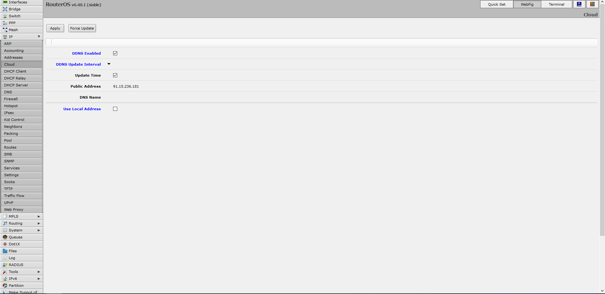
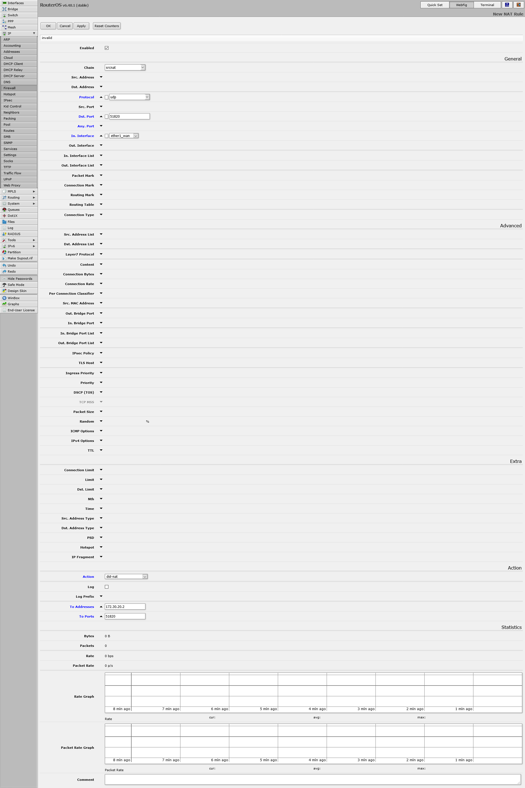

## Anleitung für Mikrotik RoutrtOS

#### DynDNS einrichten

1. Auf der Oberfläche vom RouterOS zu IP > CLoud
2. Haken bei DDNS Enabled setzen
3. Auf Apply oder OK klicken.

#### Portfreigabe einrichten

1. Auf der Oberfläche zu IP > Firewall > Nat gehen
2. Neue Regel hinzufügen
3. Chain auf dstnat einstellen
4. Protocol aud udp stellen
5. dstport auf 51820 einstellen
6. ininterface auf ether1 setzen
7. Action auf dst-nat stellen
8. Als To Address die IP des VPN-Server einstellen
9. Bei To Ports 51820 reinschreiben
10. Auf Apply oder OK klicken